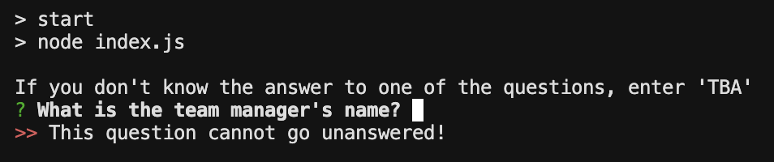
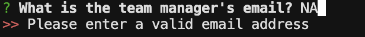
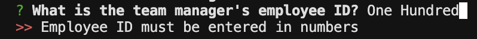
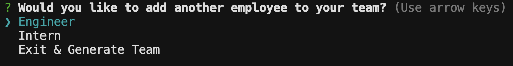
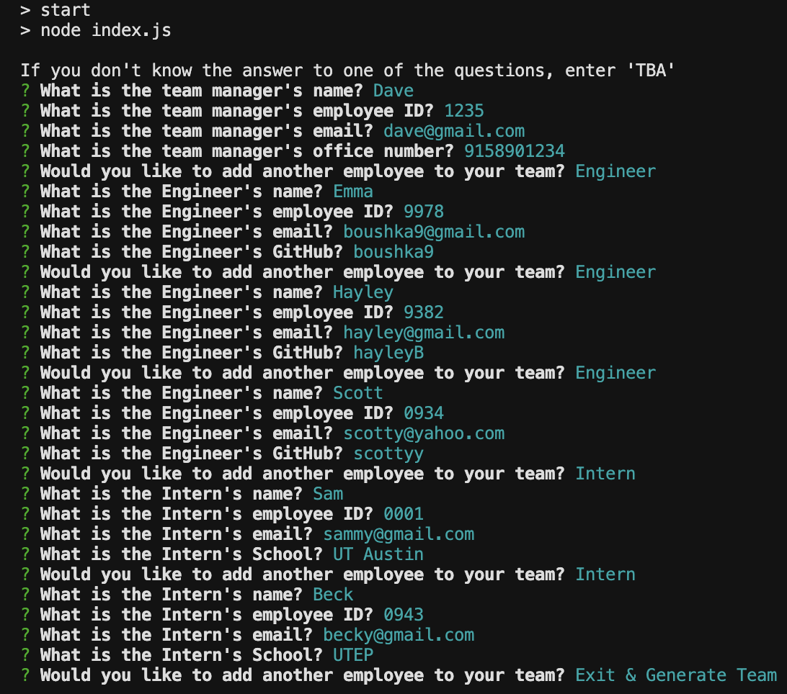
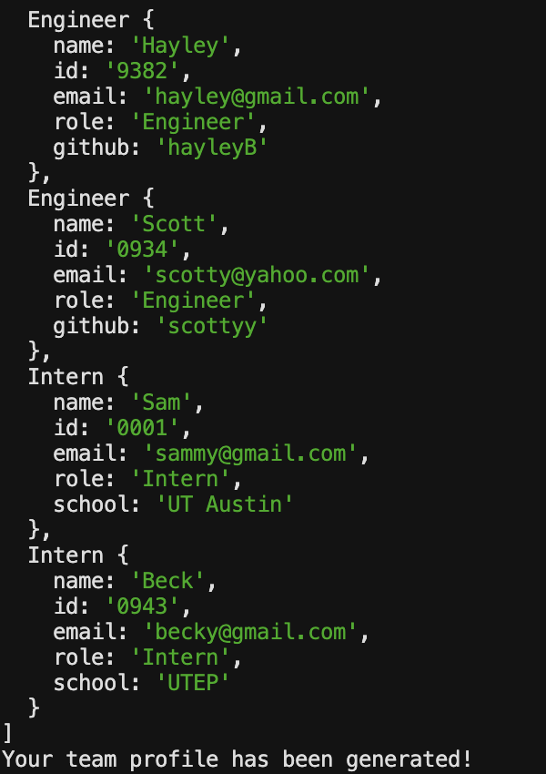
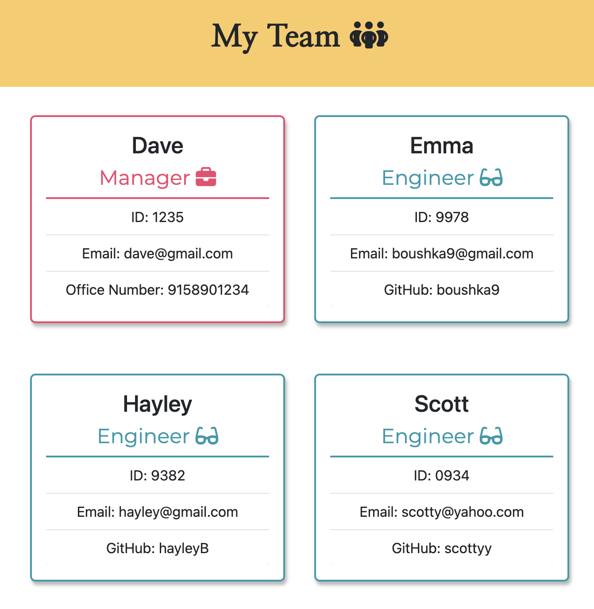
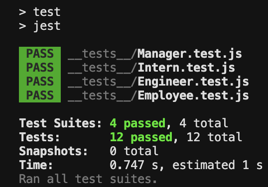

# Team Profile Generator 

  

  ## Description

  This application was created to allow users to quickly create profiles for each member of their  team to allow them easy access to their team member's information, such as their email address, GitHub username, ID  number, or office number. This application was created using Node.js, inquirer, fs, and path. Once a user has entered the neccessary information for their team and exits the terminal application, their team's information is stored and accessed via the class 'Employee' and the extended classes of 'Manager', 'Engineer', and 'Intern'.

  ## Table of Contents

  - [Installation](#installation)
  - [Usage](#usage)
  - [Credits](#credits)
  - [License](#license)

  ## Installation

  This application runs on your computors terminal via Node.js and requires that you have inquirer, fs, and path installed. Clone the code @ https://github.com/boushka9/pastel-flower-frog and type 'npm start' into your terminal.

  ## Usage

  Walkthrough: https://drive.google.com/file/d/1w-5hufDxbDv20jQBeJwyexzipIkyrEBR/view?usp=sharing 

  Type 'npm start' into your terminal for the prompts to begin.

  First, you will be presented with prompts regarding your managers information. Prompts must be answered with valid inputs. If your input is invalid you will recieve an error message. No question can be left blank, so if you do not know the answer to a question, input 'TBA'. Press enter to continue to the next prompt.

  

  

  

  Once you have answered the prompts for your manager, you will be prompted with a menu giving you the option to add more team-members as an  'Engineer' or 'Intern', or to exit the application and generate your team profile.

   

  If you select 'Engineer', you will need to provide the GitHub username for that team-member. If you select 'Intern', you will need to provide the name of their School.
  After you have answered the prompts for each employee, you will be taken back to the prompt menu. You can enter as many employees as you want.

  When you have entered all members of your team, select 'Exit & Generate Team'.
  
    

   Once your team profile has been generated you will see your responses along with a message indicating your profiles have been successfully generated.

  

  The corresponding team profile can be found in the 'index.html' within the 'dist' folder.

  

  ## Credits

  N/A

  ## License

  This project is licensed under the terms of the MIT license 

  ---

  ## Badges

        

  ## How to Contribute

  N/A

  ## Tests

  Tests for this application were created using Jest. The tests target the classes 'Employee', 'Manager', 'Engineer', and 'Intern' to determine that the new classes are being created correctly and that their content is being stored and accessed as expected. To run the tests type 'npm test' in the terminal.

  

  ## Questions

  If you have any questions regarding this application please contact me through email or GitHub:

  boushka9@gmail.com

  boushka9

  